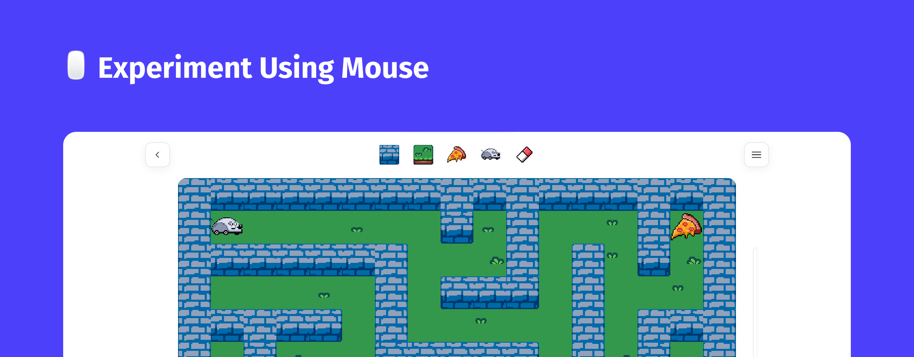

<h1 align="center">
  🖱️ Experiment Using Mouse
</h1>

<h1 align="center">
    
</h1>

Project initially thought to build a graphic part of the exercise number `9.2` of the USP IME college's list of exercises for Computer Science ([link](https://www.ime.usp.br/~macmulti/caderno-exercicios-versao2005.pdf) to list of exercises), where the challenge is to help a mouse find a piece of cheese in a maze.

## Planned features
- [ ] Auditory effects
- [ ] Multiple players in one room

## Architecture
How this software works internally and how it interacts with external dependencies - written in detail at [`ARCHITECTURE`](./docs/architecture.md).

## License
This project is under license. See the [`LICENSE`](./LICENSE) file for details.
This project is using licensed files. See the [`BLACKMAGIC FAIRLIGHT SOUND LIBRARY`](https://www.blackmagicdesign.com/products/davinciresolve/fairlight) page for details.