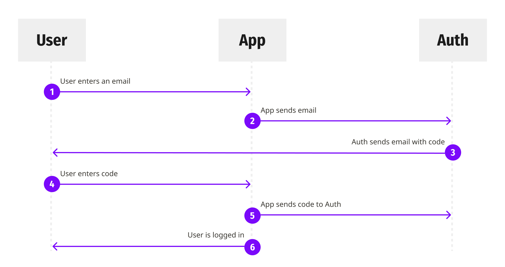

## Authentication
`Passwordless otc-based` is used, where a one-time use code (oct) is sent by emai for the customer to login. There is no need for the user to remember the password and increasing security.

<h1 align="center">
    
</h1>

### Passwordless endpoints

#### POST auth/login
Used to initiate the passwordless authentication process by sending a one-time code via email.
The call must be made as follows:

```json
POST https://{ domain }/auth/login
Content-Type: application/json
{
  "connection": "email",
  "email": "{ email }", //set for connection=email
  "send": "code",
}
```

#### POST auth/authenticate
Used to exchange the otc for authentication tokens, after the user inserts the code, it makes the call with the following parameters:

```HTTP
POST https://{ domain }/auth/authenticate
Content-Type: application/json
{
  "email": "{ email }",
  "otp": "CODE",
  "realm": "email",
}
```

After the successful call, the response will have the following properties:

```HTTP
HTTP/2.0 200 OK
Content-Type: application/json
Set-Cookie: access_token={ accessToken }; Path=/; HttpOnly; SameSite=None; Secure
{
    "auth": true,
    "token_type": "jwt",
    "expires_in": 86400 // 24 hours
}
```